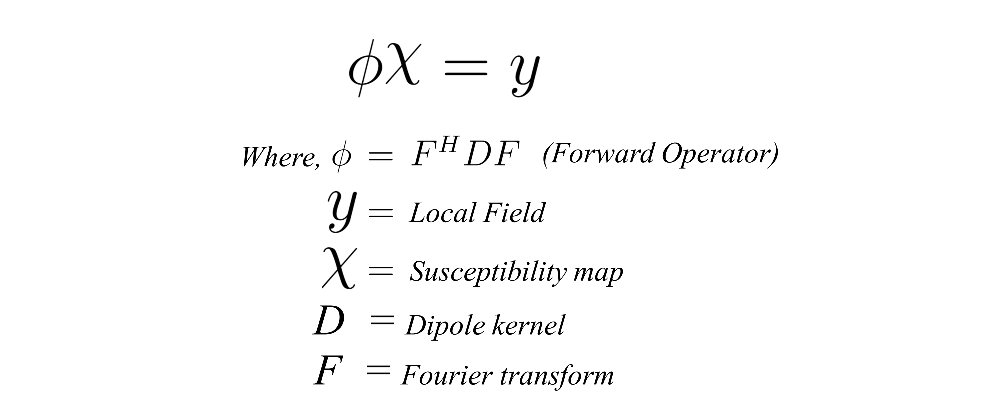

<html>
<head>
</head>
<body>

<h1>MSFF-QSMNet: An Efficient Multi-Scale Feature Fusion Network for QSM Reconstruction</h1>
<h2> QSM problem</h2>
QSM provides information about the underlying magnetic susceptibility distribution of a sample from MRI phase measurements. It is useful in the clinical diagnosis of diseases  like Demyelination, Calcification, and Parkinson’s disease.
  
The mathematical relation for the QSM reconstruction is:

For solving QSM problem, it is required peform dipole deconvolution with local field. It is very cruical step in the QSM solving. Unfortunately, this it is an illposed problem.

<h2>MSFF-QSMNet Architecture</h2>

<h2>Sample QSM reconstruction on QSM-2016 challenge data</h2>  
  

<h2> How to run the code</h2>
First, ensure that PyTorch 1.10 or higher version is installed and working with GPU. Second, just clone or download this reporsitory. The SpiNet_QSM_demo_run.py file should run without any changes in the code. 

We can run from the command for the training the MSFF-QSMNet: 

**`python train.py --model=MSFF_QSMNet --name=demo1 --saveroot=./savedModels --lr=0.001 --batch-size=8 --epoch=50 --ngpu=2`**.

We can check the quality of the MSFF-QSMNet output by running the **`metrics_evaluation.m`**. It calculates the **`SSIM, pSNR, RMSE, HFEN`**.
# Dependencies
<li> Python  </li>  
<li> PyTorch 2.10 </li>
<li> MATLAB R2022b </li>
  
# Files description

**`MSFF_QSMNet_Model.py:`** This file contains the pytorch implementation code for the proposed MSFF-QSMNet model with various settings. 

**`loss.py:`** This file contains the the various loss functions utilized in the training.

**`utils.py:`** This file contains the code for many supporting functions for the previous Python code files.

**`savedModels:`** This directory contain's the learned PyTorch 1.10 model parameters. 

**`train.py:`** This file contains the code for the training MSFF-QSMNet with various settings. 

**`test_on_qsm_2016_challange_data.py:`** This file contains the code for the testing MSFF-QSMNet on the <a href="http://www.neuroimaging.at/pages/qsm.php">QSM-2016 challenge data</a>. 

# Contact
Dr. Phaneendra K. Yalavarthy

Assoc.Prof, CDS, IISc Bangalore, email : yalavarthy@iisc.ac.in

Vaddadi Venkatesh

(PhD) CDS, MIG, IISc Bangalore, email : venkateshvad@iisc.ac.in
</body>
</html>
