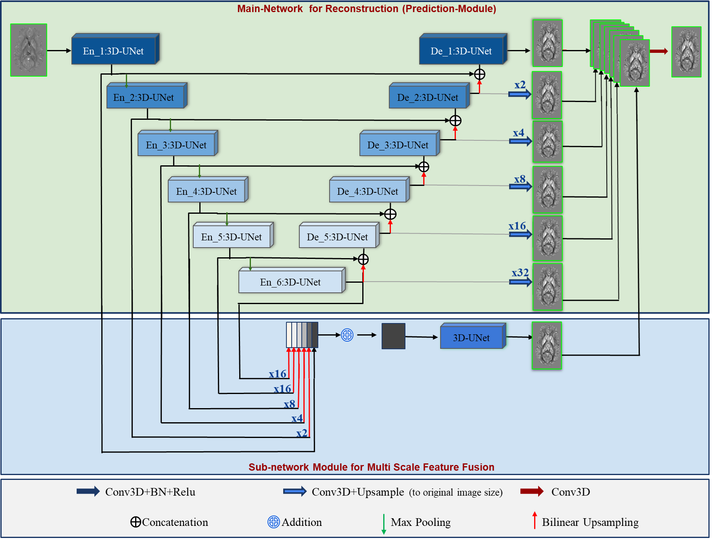
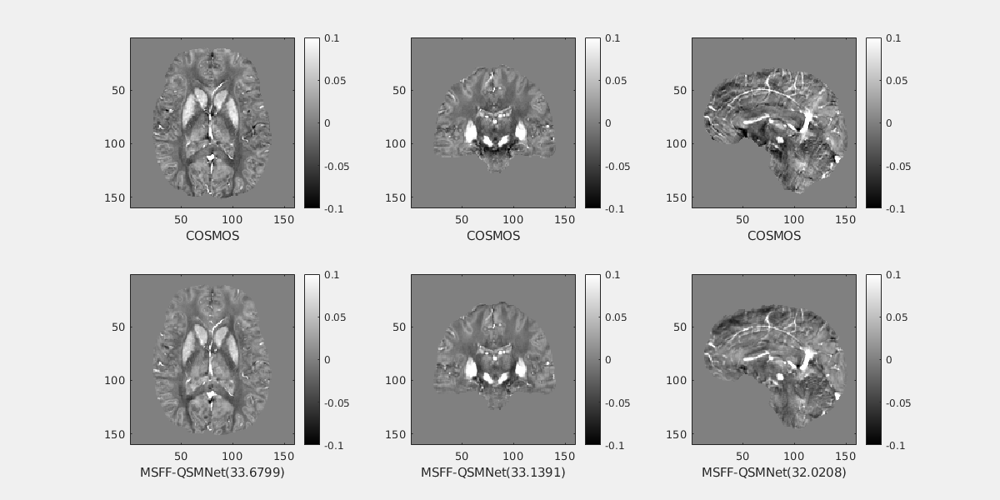

<html>
<head>
</head>
<body>

<h1>MSFF-QSMNet: An Efficient Multi-Scale Feature Fusion Network for QSM Reconstruction</h1>

<h2>MSFF-QSMNet Architecture</h2>

<h2>Sample QSM reconstruction on QSM-2016 challenge data</h2>  
  

<h2>MSFF-QSMNet reconstruction on complete training data</h2>

 
QSM maps reconstructed on complete training data were shown in the first row, and residual error maps in the second row.

  
# How to run the code
First, ensure that PyTorch 1.10 or higher version is installed and working with GPU. Second, just clone or download this reporsitory. The SpiNet_QSM_demo_run.py file should run without any changes in the code. 

We can run from the command for the training the MSFF-QSMNet: 

**`python train.py --model=MSFF_QSMNet --name=demo1 --saveroot=./savedModels --lr=0.001 --batch-size=8 --epoch=50 --ngpu=2`**.

We can check the quality of the MSFF-QSMNet output by running the **`metrics_evaluation.m`**. It calculates the **`SSIM, pSNR, RMSE, HFEN`**.
# Dependencies
<li> Python  </li>  
<li> PyTorch 1.10 </li>
<li> MATLAB R2022b </li>
  
# Files description
**`train.py:`** This file contains the code for the training MSFF-QSMNet with various settings. 

**`MSFF_QSMNet_Model.py:`** This file contains the pytorch implementation code for the proposed MSFF-QSMNet model with various settings. 

**`loss.py:`** This file contains the the various loss functions utilized in the training.

**`utils.py:`** This file contains the code for many supporting functions for the previous Python code files.

**`savedModels:`** This directory contain's the learned PyTorch 1.10 model parameters. 

# Contact
Dr. Phaneendra K. Yalavarthy

Assoc.Prof, CDS, IISc Bangalore, email : yalavarthy@iisc.ac.in

Vaddadi Venkatesh

(PhD) CDS, MIG, IISc Bangalore, email : venkateshvad@iisc.ac.in
</body>
</html>
